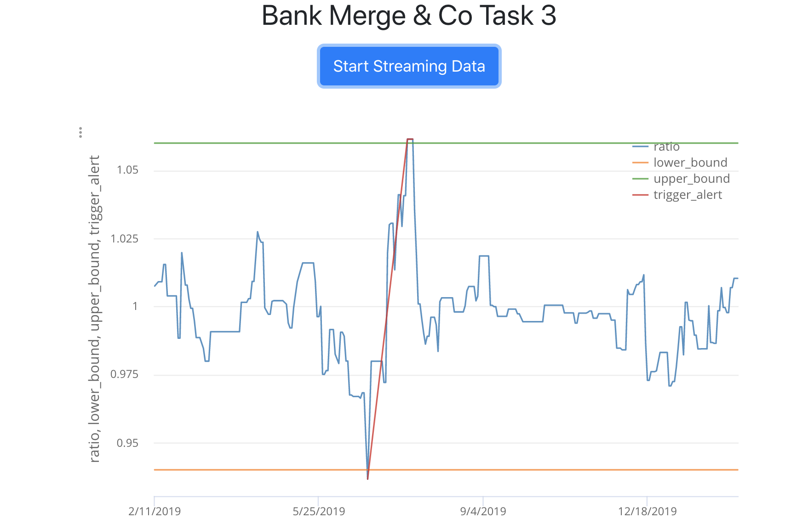

# JPMC-Virtual-Experience
JP-Morgan Chase Software Engineering Virtual Experience

## Overview
A trader from the equities team has requested functionality be added to their dashboard to allow them to input specific information so they can monitor a new trading strategy. You task is to set up your system so you can interface with the relevant financial data feed, make the required calculations and then present this in a way that allows the traders to visualize and analyze this data in real time.

## Tasks
* Interface with a stock price data feed and set up your system for analysis of the data
* Implement the Perspective open source code in preparation for data visualization
* Use Perspective to create the chart for the trader's dashboard
* Make a contribution to perspective or other project backlogs

## Product
Built a client-side web application using Python, React, Typescript, and Perspective that displays a live graph of stock trends and alerts traders of potential trading opportunities in a simple and visually clear way

